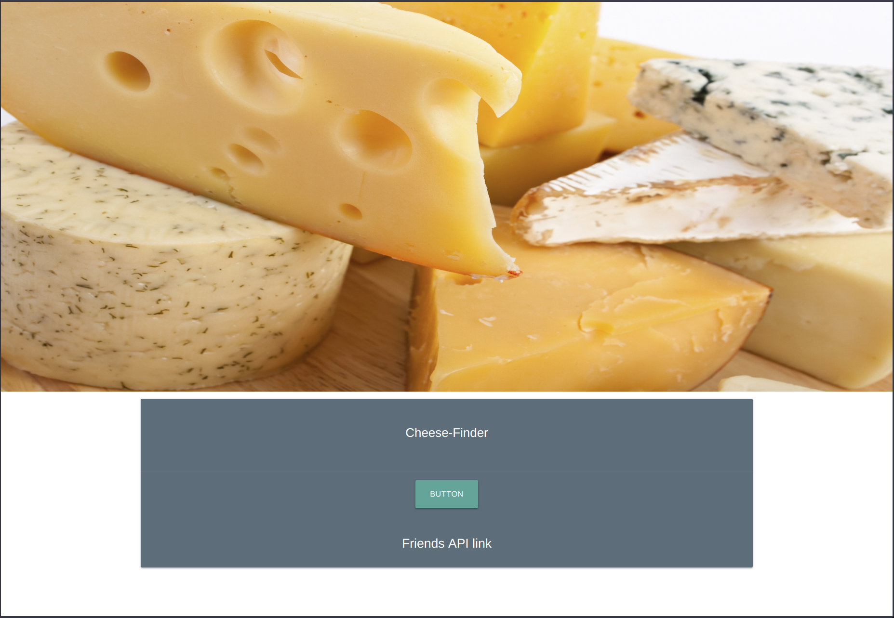
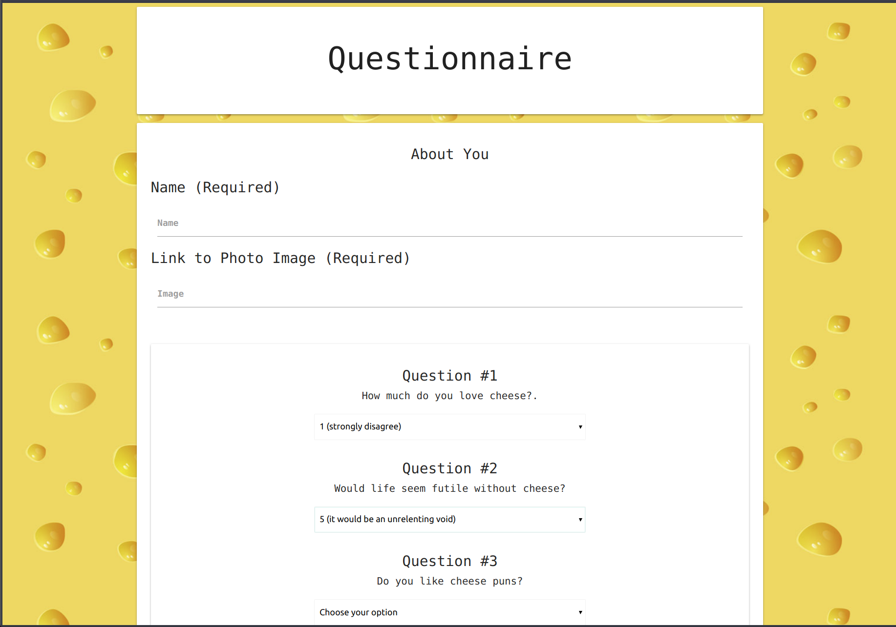

### # Chinder

# Description
### Chinder is an application that has the user fill out a small 10 question survey, After the completion of the survey it matches them with a cheese (or) cheeses that best suits them. This is done by a small calculation that compares the score the of the user after completing the survey and comparing it to the scores given to each cheese. The users data is then stored in the FriendsAPI.  

# Technoogies used
* Node.js
* Express
* Javascript
* jQuery
* Materialize
* HTML
## NPM Packages
* Express
* Body-parser
* PATH

# User Guide
### Pre-requisites
* Node.js / NPM
## Clone repo to your local machine
### Navigate to the correct directory. Run NPM Install to install the required packages In a CLI of your choosing & then run -> node server ( or _nodemon server_ )
## open your browser and navigate to localhost:3000 and find out the cheese for you!

## Developed by: Jake Plaisted
#### September 2018
